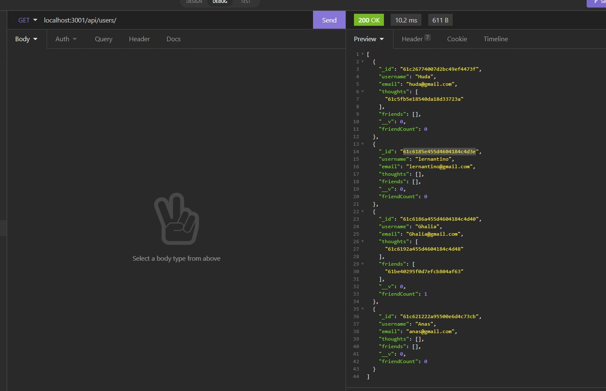

# Social-Network-API

## Purpose:
Back-end social networking platform application by MongoDB.

## Description:
GIVEN a social network API
* WHEN the user enters the command to invoke the application
* THEN the server is started, and the Mongoose models are synced to the MongoDB database
* WHEN the user opens API GET routes in Insomnia Core for users and thoughts
* THEN the data for each of these routes are displayed in a formatted JSON
* WHEN the user tests API POST, PUT, and DELETE routes in Insomnia Core
* THEN  the user is able to successfully create, update, and delete users and thoughts in my database
* WHEN  the user tests API POST and DELETE routes in Insomnia Core
* THEN  the user is able to successfully create and delete reactions to thoughts and add and remove friends to a user’s friend list

## instructions: 

* Install the npm package , then enter 'node server' OR
* visit the walk throw videos (https://youtu.be/BYJG855zF40) (https://youtu.be/Cv43ktd4eOA)

## Usage:
After installing npm and running the Server, Open Insomnia and write the routes:
*/api/users to access all users
*/api/thoughts to access all thoughts
like the following snip:

### Contribution:
Made with ❤️️ by Ghalia Sami  
For more information, Please contact me.
Email: ghaliarose89@gmail.com

### ©️ [2021] [Ghalia Sami]